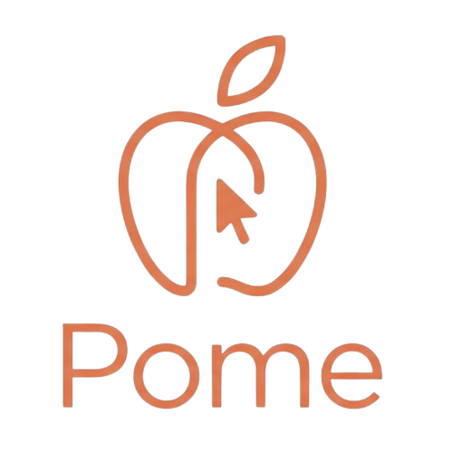

# Pome Programming Language

<div align="center">
  
  <p><strong>A lightweight, dynamically-typed programming language written in C++</strong></p>
</div>

---

## Overview

**Pome** is a compact, interpreted programming language created as a **learning project** to explore interpreter design and implementation. It demonstrates fundamental concepts in language design including lexing, parsing, AST traversal, and runtime value management. The language features dynamic typing, object-oriented programming capabilities, garbage collection, and a modular system for code organization. Built entirely in C++, Pome serves as an educational foundation for understanding how programming languages work internally.

> Note: Pome is supposed to be a successor of an old interpreted programming language I made. I improved the underlying architecture and extended its capabilities so I can potentially use it for actual programming tasks and learning more about programming language's ecosystems.

## Features

### Core Language Features

- **Dynamic Typing**: No explicit type declarations required. Types are inferred at runtime.
- **Object-Oriented Programming**: Full support for classes, inheritance, and methods with the `this` keyword.
- **Functions**: First-class functions with closures and higher-order function support.
- **Control Flow**: Complete support for `if/else`, `while`, and `for` loops.
- **Operators**: Comprehensive operator support including arithmetic, comparison, logical, and assignment operators.
- **Ternary Operator**: Conditional expressions for concise control flow.

### Advanced Features

- **Module System**: Import and export modules for better code organization and reusability.
- **Garbage Collection**: Automatic memory management with mark-and-sweep GC.
- **Standard Library**: Built-in functions and modules:
  - **math**: Mathematical operations including `sin`, `cos`, `random`, and constants like `pi`.
  - **string**: String manipulation utilities like `sub` (substring).
  - **io**: File I/O operations (`readFile`, `writeFile`).
  - **print**: Universal output function.

### Data Types

- **Primitives**: `nil`, `true`/`false`, numbers (integers and floats)
- **Collections**: Lists and Tables (associative arrays/dictionaries)
- **Complex Types**: Functions, Classes, and Instances

## Quick Start

### Building from Source

#### Prerequisites

- C++17 compatible compiler (GCC, Clang, or MSVC)
- CMake 3.10 or higher

#### Build Instructions

```bash
# Clone the repository
cd Pome

# Create a build directory
mkdir build
cd build

# Configure and build
cmake ..
make

# Run a Pome script
./pome ../examples/demo.pome
```

### Running Scripts

Pome scripts are plain text files with the `.pome` extension:

```bash
./pome script.pome
```

## Documentation

For comprehensive guides on the Pome language, visit the **[docs/](docs/)** directory:

- **[Getting Started](docs/01-getting-started.md)** - Installation and first program
- **[Language Fundamentals](docs/02-language-fundamentals.md)** - Variables, types, and basic syntax
- **[Control Flow](docs/03-control-flow.md)** - Conditionals and loops
- **[Functions](docs/04-functions.md)** - Functions, closures, and higher-order functions
- **[Object-Oriented Programming](docs/05-oop.md)** - Classes and objects
- **[Collections](docs/06-collections.md)** - Lists and tables
- **[Operators Reference](docs/07-operators.md)** - Complete operator guide
- **[Module System](docs/08-modules.md)** - Code organization and imports
- **[Standard Library](docs/09-standard-library.md)** - Built-in functions and modules
- **[Error Handling](docs/10-error-handling.md)** - Debugging and testing
- **[Advanced Topics](docs/11-advanced-topics.md)** - Advanced patterns and techniques
- **[Architecture](docs/12-architecture.md)** - Internal design and implementation (for contributors)

**[→ Full Documentation Index](docs/README.md)**

## Language Guide

### Variables and Data Types

```pome
var x = 10;              // Integer
var y = 3.14;            // Float
var message = "Hello";   // String
var flag = true;         // Boolean
var nothing = nil;       // Nil (null equivalent)
var items = [1, 2, 3];   // List
var person = {           // Table (dictionary)
    name: "Alice",
    age: 30
};
```

### Control Flow

```pome
// If-Else Statements
if (x > 0) {
    print("Positive");
} else if (x < 0) {
    print("Negative");
} else {
    print("Zero");
}

// While Loop
var counter = 0;
while (counter < 5) {
    print(counter);
    counter = counter + 1;
}

// For Loop
for (var i = 0; i < 3; i = i + 1) {
    print("Iteration:", i);
}

// Ternary Operator
var result = x > 0 ? "positive" : "non-positive";
```

### Functions

```pome
// Function declaration and call
fun add(a, b) {
    return a + b;
}

var sum = add(5, 3);  // sum = 8

// Anonymous functions (closures)
fun makeCounter() {
    var count = 0;
    return fun() {
        count = count + 1;
        return count;
    };
}

var counter = makeCounter();
print(counter());  // 1
print(counter());  // 2
```

### Object-Oriented Programming

```pome
// Class definition
class Dog {
    fun init(name) {
        this.name = name;
        this.sound = "Woof";
    }

    fun speak() {
        print(this.name, "says", this.sound);
    }
    
    fun setSound(s) {
        this.sound = s;
    }
}

// Creating and using instances
var dog = Dog("Buddy");
dog.speak();           // Output: Buddy says Woof
dog.setSound("Bark");
dog.speak();           // Output: Buddy says Bark
print(dog.name);       // Output: Buddy
```

### Module System

```pome
// Exporting from a module (in my_module.pome)
export fun add(a, b) {
    return a + b;
}

// Importing and using a module
import my_module;
var result = my_module.add(5, 3);

// Using built-in modules
import math;
import string;
import io;

print("PI:", math.pi);
print("Substring:", string.sub("Hello", 0, 3));
io.writeFile("output.txt", "Hello, Pome!");
```

### Standard Library

#### Math Module
- `math.pi` - Pi constant
- `math.sin(x)` - Sine function
- `math.cos(x)` - Cosine function
- `math.random()` - Random number between 0 and 1

#### String Module
- `string.sub(str, start, end)` - Extract substring

#### IO Module
- `io.readFile(path)` - Read file contents
- `io.writeFile(path, content)` - Write content to file

#### Global Functions
- `print(...)` - Print values to stdout
- `len(collection)` - Get length of list or table
- `type(value)` - Get type name of value

## Project Structure

```
Pome/
├── CMakeLists.txt          # CMake build configuration
├── assets/
│   └── logo.png            # Project logo
├── include/                # Header files
│   ├── pome_lexer.h        # Tokenization
│   ├── pome_parser.h       # Parsing to AST
│   ├── pome_interpreter.h  # Execution engine
│   ├── pome_value.h        # Runtime value types
│   ├── pome_environment.h  # Variable scoping
│   ├── pome_stdlib.h       # Built-in library
│   ├── pome_gc.h           # Garbage collector
│   ├── pome_importer.h     # Module system
│   ├── pome_ast.h          # AST node definitions
│   └── pome_errors.h       # Error handling
├── src/                    # Implementation files
│   ├── main.cpp            # Entry point
│   ├── pome_lexer.cpp      # Lexer implementation
│   ├── pome_parser.cpp     # Parser implementation
│   ├── pome_value.cpp      # Value type implementation
│   ├── pome_environment.cpp# Environment implementation
│   ├── pome_interpreter.cpp# Interpreter implementation
│   ├── pome_stdlib.cpp     # Standard library implementation
│   ├── pome_gc.cpp         # Garbage collector implementation
│   └── pome_importer.cpp   # Module system implementation
├── examples/               # Example Pome scripts
│   ├── demo.pome           # Basic language features
│   ├── test_class.pome     # Object-oriented examples
│   ├── test_stdlib.pome    # Standard library usage
│   ├── test_for_loops.pome # Loop examples
│   ├── test_math.pome      # Math operations
│   └── ...                 # Additional examples
├── test/                   # Test files
└── build/                  # Build artifacts (generated)
```

## Architecture

Pome follows a classic interpreter architecture:

1. **Lexer** (`pome_lexer`): Tokenizes source code into a stream of tokens.
2. **Parser** (`pome_parser`): Builds an Abstract Syntax Tree (AST) from tokens.
3. **Interpreter** (`pome_interpreter`): Walks the AST and executes the program.
4. **Value System** (`pome_value`): Represents runtime values and objects.
5. **Environment** (`pome_environment`): Manages variable scopes and bindings.
6. **Standard Library** (`pome_stdlib`): Provides built-in functions and modules.
7. **Garbage Collector** (`pome_gc`): Automatically manages memory.
8. **Module System** (`pome_importer`): Handles code organization and imports.

## Examples

### Hello World

```pome
print("Hello, World!");
```

### Fibonacci Sequence

```pome
fun fibonacci(n) {
    if (n <= 1) return n;
    return fibonacci(n - 1) + fibonacci(n - 2);
}

for (var i = 0; i < 10; i = i + 1) {
    print("fib(" + i + ") = " + fibonacci(i));
}
```

### Working with Classes

```pome
class Calculator {
    fun init() {
        this.result = 0;
    }
    
    fun add(x) {
        this.result = this.result + x;
        return this;
    }
    
    fun multiply(x) {
        this.result = this.result * x;
        return this;
    }
    
    fun getResult() {
        return this.result;
    }
}

var calc = Calculator();
var answer = calc.add(5).multiply(3).getResult();
print("Result:", answer);  // Output: Result: 15
```

### File I/O

```pome
import io;

// Write to file
io.writeFile("greeting.txt", "Hello from Pome!");

// Read from file
var content = io.readFile("greeting.txt");
print("File contents:", content);
```

## Version

Current version: **0.1.0**

## Platform Support

- **Linux**: Full support
- **macOS**: Full support
- **Windows**: Full support

## Contributing

Contributions are welcome! Please feel free to submit pull requests or open issues for bugs and feature requests.

## License

This project is licensed under the MIT License - see the [LICENSE](LICENSE) file for details.

## About This Project

Pome was created as a **learning project** to understand the fundamental concepts behind programming language implementation. Through building Pome, I explored:

- **Lexical Analysis**: Tokenizing source code
- **Syntax Analysis**: Building Abstract Syntax Trees
- **Semantic Analysis**: Type checking and scope management
- **Runtime Execution**: Interpreting and executing code
- **Memory Management**: Implementing garbage collection
- **Modularity**: Building an extensible module system

This refactored version improves upon the original implementation with better code organization and architecture.

### Inspiration

Pome draws inspiration from languages like Lua, Python, and Lox—languages known for their clarity and educational value in language design.

---

**Happy Pome-ming!** 🍎✨
