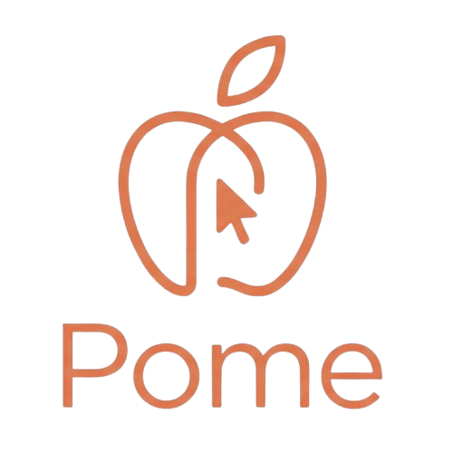

# Pome Programming Language

<div align="center">
  
  <p><strong>A high-performance, register-based programming language written in C++</strong></p>
</div>

---

## Overview

**Pome** is a high-performance, modern programming language runtime. Originally created as a learning project to explore interpreter design, it has evolved into a stable and capable system featuring a **Register-based Virtual Machine**, **NaN-boxing**, and a **Generational Garbage Collector**. 

Built entirely in C++17, Pome bridges the gap between the simplicity of dynamic scripting and the performance of low-level virtual machines. It features a clean, expressive syntax inspired by Lua and JavaScript while providing powerful modern features like a robust module system and class-based inheritance.

> Note: Pome is supposed to be a successor of an old interpreted programming language I made. I improved the underlying architecture and extended its capabilities so I can potentially use it for actual programming tasks and to learn more about programming languages ecosystems.

## Features

### Core Language Features

- **Register-based VM**: Linear bytecode execution with register-to-register instructions, reducing instruction count and improving performance.
- **NaN-Boxing**: Efficient 64-bit value representation that minimizes memory footprint and maximizes CPU cache efficiency.
- **Dynamic Typing**: No explicit type declarations required. Types are inferred at runtime.
- **Object-Oriented Programming**: Full support for classes, single inheritance (`extends`), and `super` calls.
- **Functions & Closures**: First-class functions with lexical scoping and persistent captured state.
- **Advanced Control Flow**: Support for `if/else`, `while`, `for`, and `for ... in` (ForEach) loops, with `break` and `continue` control.
- **Operators**: Comprehensive support including arithmetic, comparison, logical, ternary (`? :`), and compound assignments (`+=`, `-=`, etc.).
- **Strict Mode**: Enforce safety with `strict pome;` to prevent accidental global pollution and undeclared variables.

### Advanced Features

- **Generational GC**: Modern garbage collection that optimizes for short-lived objects to reduce pause times.
- **Native Extensions**: Extend Pome with high-performance C++ modules loaded dynamically (`.so`, `.dll`).
- **Module System**: Robust import/export system with relative path resolution based on the script's directory.
- **Standard Library**: Built-in modules:
  - **math**: `sin`, `cos`, `random`, `pi`, `sqrt`, `abs`, etc.
  - **string**: `sub` (substring), `lower`, `upper`.
  - **list**: `push`, `pop`.
  - **io**: File I/O (`readFile`, `writeFile`).
  - **time**: Timing utilities (`clock`, `sleep`).

### Developer Experience (DX)
- **Rich Error Reporting**: Professional runtime errors with **full stack traces**, line numbers, and file/module context.
- **LSP Support**: Built-in `pome-lsp` for diagnostics and autocompletion.
- **Standard Formatter**: `pome-fmt` for consistent code styling.

## Quick Start

### Installation (User-Local)

```bash
# Clone the repository
git clone https://github.com/pomilon/Pome.git
cd Pome

# Run the local installer
chmod +x install.sh
./install.sh
```

Ensure `~/.local/bin` is in your `PATH`.

### Running Scripts

```bash
pome script.pome
```

For the interactive shell (REPL):

```bash
pome
```

## Documentation

For comprehensive guides, visit the **[docs/](docs/)** directory:

- **[Getting Started](docs/01-getting-started.md)** - Installation and first program
- **[Language Fundamentals](docs/02-language-fundamentals.md)** - Variables, types, and basic syntax
- **[Control Flow](docs/03-control-flow.md)** - Conditionals, loops, and `break`/`continue`
- **[Functions](docs/04-functions.md)** - Functions, closures, and scoping
- **[Object-Oriented Programming](docs/05-oop.md)** - Classes, inheritance, and `super`
- **[Collections](docs/06-collections.md)** - Lists and tables
- **[Operators Reference](docs/07-operators.md)** - Complete operator guide
- **[Module System](docs/08-modules.md)** - Imports, exports, and path resolution
- **[Standard Library](docs/09-standard-library.md)** - Built-in modules reference
- **[Error Handling](docs/10-error-handling.md)** - Debugging and stack traces

## Language Guide

### Variables and Data Types

```pome
strict pome;

var x = 10;              // Number
var message = "Hello";   // String
var items = [1, 2, 3];   // List
var person = {           // Table
    name: "Alice",
    age: 30
};

x += 5;                  // Compound assignment (15)
var status = x > 10 ? "High" : "Low"; // Ternary operator
```

### Control Flow

```pome
// For-In Loop
var fruits = ["apple", "banana"];
for (var f in fruits) {
    if (f == "banana") break;
    print(f);
}

// Standard Loop with control
for (var i = 0; i < 10; i = i + 1) {
    if (i % 2 == 0) continue;
    print(i);
}
```

### Object-Oriented Programming

```pome
class Animal {
    fun init(name) { this.name = name; }
    fun greet() { print("Hello, I am", this.name); }
}

class Dog extends Animal {
    fun greet() {
        super.greet();
        print("Woof!");
    }
}

var dog = Dog("Buddy");
dog.greet();
```

## Architecture

1. **Compiler**: Translates AST into optimized **Register-based Bytecode**.
2. **VM Engine**: Executes instructions using **Threaded Dispatch** (Computed GOTOs).
3. **Memory**: **Generational GC** with a **Write Barrier**.
4. **Value System**: **NaN-Boxing** for efficient 64-bit value representation.

---

**Happy Pome-ming!** 🍎✨
